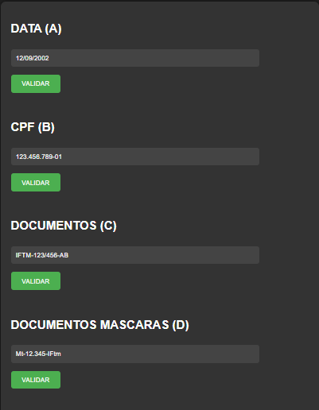
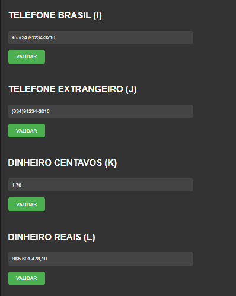
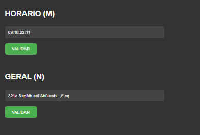

# EXPRESSÕES REGULARES
👨‍⚖️EXPRESSÕES REGULARES, TAMBÉM CONHECIDAS COMO REGEX, SÃO PADRÕES DE BUSCA UTILIZADOS EM LINGUAGENS DE PROGRAMAÇÃO PARA ENCONTRAR DETERMINADOS PADRÕES DE TEXTO. 

 <br>
 <br>
 <br>
 <br>

## DESCRIÇÃO:
Este aplicativo é um conjunto de formulários para validar diferentes tipos de dados usando expressões regulares. Aqui está uma descrição detalhada do que cada parte do aplicativo faz:

1. **Data (A):** Este campo é destinado para inserir uma data no formato "dd/mm/aaaa". A função `regexa()` valida se o valor inserido corresponde a este padrão.

2. **CPF (B):** Este campo é destinado para inserir um número de CPF no formato "###.###.###-##". A função `regexb()` valida se o valor inserido corresponde a este padrão.

3. **Documentos (C):** Este campo é destinado para inserir um número de documento no formato "IFTM-###/###-##" ou "iftm-###/###-##". A função `regexc()` valida se o valor inserido corresponde a um desses padrões.

4. **Documentos Máscaras (D):** Este campo é destinado para inserir um número de documento no formato "MT-##.###-IFTM" ou "mt-##.###-iftm". A função `regexd()` valida se o valor inserido corresponde a um desses padrões.

5. **Documentos Máscaras (E):** Este campo é similar ao anterior, mas não permite variações na capitalização. A função `regexe()` valida se o valor inserido corresponde ao padrão "MT-##.###-IFTM".

6. **Documentos Máscaras (F):** Este campo é similar aos anteriores, mas permite espaços opcionais antes das letras e distingue entre maiúsculas e minúsculas. A função `regexf()` valida se o valor inserido corresponde ao padrão "MT-##.###-IFTM" ou "mt-##.###-iftm".

7. **Documentos Máscaras (G):** Este campo é similar aos anteriores, mas permite também a especificação de um local. A função `regexg()` valida se o valor inserido corresponde ao padrão "MT-##.###-IFTM Uberlândia Centro" ou "mt-##.###-iftm Uberlândia Centro".

8. **Documentos Máscaras (H):** Este campo é similar aos anteriores, mas especifica apenas o campus do IFTM em Uberlândia. A função `regexh()` valida se o valor inserido corresponde ao padrão "IFTM campus Uberlândia" ou "IFTM campus Uberlândia Centro".

9. **Telefone Brasil (I):** Este campo é destinado para inserir um número de telefone no formato "+xx(xx)xxxxx-xxxx". A função `regexi()` valida se o valor inserido corresponde a este padrão.

10. **Telefone Estrangeiro (J):** Este campo é destinado para inserir um número de telefone no formato "(xx)xxxxx-xxxx". A função `regexj()` valida se o valor inserido corresponde a este padrão.

11. **Dinheiro Centavos (K):** Este campo é destinado para inserir um valor em reais com centavos, permitindo casas decimais opcionais. A função `regexk()` valida se o valor inserido corresponde a este padrão.

12. **Dinheiro Reais (L):** Este campo é destinado para inserir um valor em reais com centavos, seguindo um formato específico. A função `regexl()` valida se o valor inserido corresponde a este padrão.

13. **Horário (M):** Este campo é destinado para inserir um horário no formato "hh:mm:ss:ff". A função `regexm()` valida se o valor inserido corresponde a este padrão.

14. **Geral (N):** Este campo é destinado para inserir qualquer sequência de caracteres. A função `regexn()` valida se o valor inserido corresponde a um padrão específico, que inclui caracteres alfanuméricos, pontos, hífens, underscores e vírgulas.

Cada função de validação utiliza uma expressão regular correspondente para verificar se o valor inserido pelo usuário está de acordo com o padrão esperado. Se o valor estiver correto, uma mensagem de sucesso é exibida, caso contrário, uma mensagem de erro é exibida.

## COMO USAR?
### BAIXANDO O PROJETO:
* Clone o repositório para o seu sistema local:

```bash
git clone https://github.com/VILHALVA/EXPRESSOES-REGULARES.git
```

* Navegue até o diretório do projeto.

```bash
cd EXPRESSOES-REGULARES
```

* Descompacte o arquivo ZIP (se você baixou manualmente):

```bash
unzip EXPRESSOES-REGULARES.zip
``` 

### EXECUTANDO O PROJETO:
1. Abra o arquivo `CODIGO.html` em seu navegador de preferência.

2. **Interaja com o formulário:** Após abrir o arquivo HTML, você verá um conjunto de campos de entrada e botões "Validar". Insira os dados nos campos de entrada conforme desejado.

3. **Clique nos botões "Validar":** Após inserir os dados nos campos de entrada, clique nos botões "Validar" correspondentes para cada campo. Isso irá acionar as funções JavaScript associadas que irão validar os dados de acordo com as expressões regulares definidas.

4. **Leia os alertas:** Dependendo da validade dos dados inseridos, você verá alertas indicando se o formulário foi validado com sucesso ou se houve algum erro de validação.

5. **Ajuste conforme necessário:** Se os dados não foram validados corretamente, verifique se estão de acordo com os padrões esperados ou faça ajustes nas expressões regulares conforme necessário.

6. **Repita conforme desejado:** Repita os passos acima conforme desejar para testar diferentes tipos de dados e padrões de validação.

7. **Edite o código, se necessário:** Se você precisar modificar o comportamento do formulário ou as expressões regulares, pode editar os arquivos HTML, JavaScript e CSS conforme necessário e recarregar a página no navegador para ver as alterações.

## NÃO SABE?
- Entendemos que para manipular arquivos em `HTML`, `CSS` e outras linguagens relacionadas, é necessário possuir conhecimento nessas áreas. Para auxiliar nesse aprendizado, oferecemos cursos gratuitos disponíveis:
* [Curso de HTML e CSS](https://github.com/VILHALVA/CURSO-DE-HTML-E-CSS)
* [Curso de JavaScript](https://github.com/VILHALVA/CURSO-DE-JAVASCRIPT)
* [Confira mais cursos](https://github.com/VILHALVA?tab=repositories&q=+topic:CURSO)

## SUBSÍDIOS:
- [CLIQUE AQUI PARA ACESSAR AO MINICURSO](./MINICURSO.md)
- [ESSE MINICURSO FOI EDITADO E ADAPTADO PELO VILHALVA](https://github.com/VILHALVA)
- [CÓDIGO ORIGINAL FOI COPIADO DE "RYANNMAGALHAES"](https://github.com/RyannMagalhaes/REGEX)
- [ESTÁ DISPONIVEL NO SITE](https://vilhalva.github.io/STYLER/STYLER.html)

